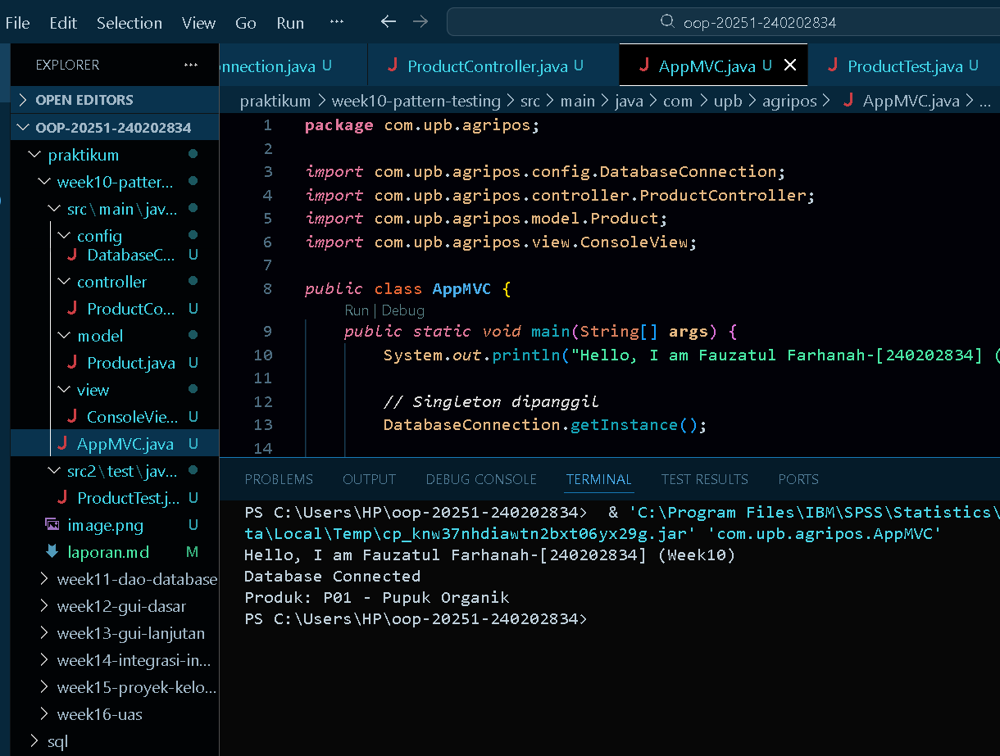
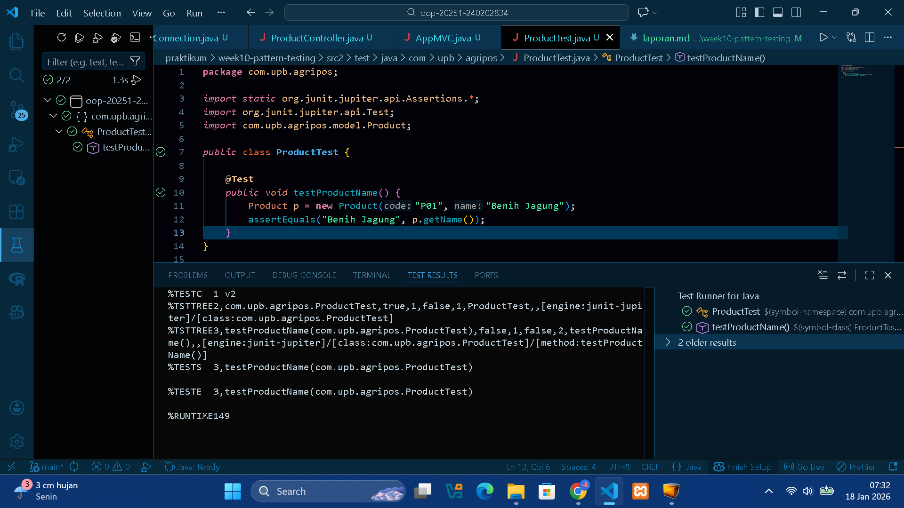

# Laporan Praktikum Minggu 10

Topik: Design Pattern (Singleton, MVC) dan Unit Testing menggunakan JUnit

## Identitas
- Nama  : [Fauzatul Farhanah]
- NIM   : [240202834]
- Kelas : [3IKRA]

---

## Tujuan
Setelah mengikuti praktikum ini, mahasiswa mampu:

1. Menjelaskan konsep dasar design pattern dalam rekayasa perangkat lunak.
2. Mengimplementasikan Singleton Pattern dengan benar.
3. Menjelaskan dan menerapkan Model–View–Controller (MVC) pada aplikasi sederhana.
4. Membuat dan menjalankan unit test menggunakan JUnit.
5. Menganalisis manfaat penerapan design pattern dan unit testing terhadap kualitas perangkat lunak.

---

## Dasar Teori
### 1. Design Pattern

Design pattern adalah solusi desain yang telah teruji untuk menyelesaikan masalah umum dalam pengembangan perangkat lunak. Fokus minggu ini:
- Singleton Pattern
- MVC (Model–View–Controller)

### 2. Singleton Pattern

Tujuan: Menjamin suatu class hanya memiliki satu instance dan menyediakan titik akses global.

Karakteristik:
- Constructor `private`
- Atribut `static instance`
- Method `static getInstance()`

Contoh Implementasi:
```java
package com.upb.agripos.config;

public class DatabaseConnection {
    private static DatabaseConnection instance;
    private DatabaseConnection() {}

    public static DatabaseConnection getInstance() {
        if (instance == null) {
            instance = new DatabaseConnection();
        }
        return instance;
    }
}
```

Penerapan pada Agri-POS: koneksi database atau service global yang tidak boleh lebih dari satu instance.

### 3. MVC (Model–View–Controller)

Memisahkan tanggung jawab aplikasi:

| Komponen | Tanggung Jawab |
|---------|------------------|
| Model   | Data dan logika bisnis |
| View    | Tampilan/output |
| Controller | Penghubung Model dan View |

Contoh Struktur MVC Sederhana:
- Model → `Product`
- View → `ConsoleView`
- Controller → `ProductController`

---

## Implementasi Praktikum

### 1. Model
```java
package com.upb.agripos.model;

public class Product {
    private final String code;
    private final String name;

    public Product(String code, String name) {
        this.code = code;
        this.name = name;
    }

    public String getCode() { return code; }
    public String getName() { return name; }
}
```

### 2. View
```java
package com.upb.agripos.view;

public class ConsoleView {
    public void showMessage(String message) {
        System.out.println(message);
    }
}
```

### 3. Controller (WAJIB DIISI)
```java
package com.upb.agripos.controller;

import com.upb.agripos.model.Product;
import com.upb.agripos.view.ConsoleView;

public class ProductController {
    private final Product model;
    private final ConsoleView view;

    public ProductController(Product model, ConsoleView view) {
        this.model = model;
        this.view = view;
    }

    public void showProduct() {
        view.showMessage("Produk: " + model.getCode() + " - " + model.getName());
    }
}
```

### 4. Main Program (Integrasi MVC)
```java
package com.upb.agripos;

import com.upb.agripos.model.Product;
import com.upb.agripos.view.ConsoleView;
import com.upb.agripos.controller.ProductController;

public class AppMVC {
    public static void main(String[] args) {
        System.out.println("Hello, I am Fauzatul Farhanah -[240202834] (Week10)");
        Product product = new Product("P01", "Pupuk Organik");
        ConsoleView view = new ConsoleView();
        ProductController controller = new ProductController(product, view);
        controller.showProduct();
    }
}
```

---

## Unit Testing Menggunakan JUnit

Tujuan unit testing:
- Memastikan fungsi berjalan sesuai harapan
- Mendeteksi kesalahan lebih awal
- Meningkatkan kepercayaan terhadap kode

### Contoh Unit Test JUnit
```java
package com.upb.agripos;

import static org.junit.jupiter.api.Assertions.*;
import org.junit.jupiter.api.Test;
import com.upb.agripos.model.Product;

public class ProductTest {
    @Test
    public void testProductName() {
        Product p = new Product("P01", "Benih Jagung");
        assertEquals("Benih Jagung", p.getName());
    }
}
```
---

## Langkah Praktikum
1. Menyiapkan struktur folder praktikum sesuai dengan ketentuan Week 10,
2. Mengimplementasikan Singleton Pattern pada class DatabaseConnection.
a. Membuat constructor dengan akses 'private' agar object tidak bisa dibuat dari luar class.
b. Menambahkan atribut 'static instance' untuk menyimpan satu-satunya instance.
c. Menyediakan method 'getInstance()' sebagai akses global.

Class DatabaseConnection kemudian dipanggil di AppMVC.java untuk memastikan Singleton berjalan.

3. Menerapkan Konsep MVC (Model–View–Controller)
a. Model
Class Product digunakan sebagai Model untuk menyimpan data produk, seperti kode produk dan nama produk.

b. View
Class ConsoleView digunakan sebagai View yang bertugas menampilkan output ke layar menggunakan 'System.out.println()'.

c. Controller
Class ProductController digunakan sebagai Controller yang menghubungkan Model dan View.

4. Integrasi MVC pada Main Program
Pada file AppMVC.java, dilakukan langkah-langkah berikut:
a. Memanggil 'DatabaseConnection.getInstance()' untuk mengaktifkan Singleton.
b. Membuat object 'Product' sebagai Model.
c. Membuat object 'ConsoleView' sebagai View.
d. Membuat object 'ProductController' sebagai Controller.
e. Menjalankan method 'showProduct()' untuk menampilkan data produk.

5. Menambahkan Library JUnit
Untuk melakukan unit testing, digunakan JUnit Platform Console Standalone.

6. Membuat Unit Test Menggunakan JUnit
Unit test dibuat pada file 'ProductTest.java'.
a. Membuat class 'ProductTest'.
b. Menambahkan anotasi '@Test'.
c. Membuat object 'Product'.
d. Menggunakan 'assertEquals()' untuk membandingkan nilai yang diharapkan dengan hasil method 'getName()'.

7. Menjalankan Unit Test 

8. Commit dan Push dengan pesan '[week10-pattern-testing: implement singleton, mvc, dan junit test]'
---

## Hasil Eksekusi
---

---

---


## Analisis
1. Bagaimana kode berjalan
**jawab** : Program dijalankan melalui class AppMVC sebagai main program.
a. Program memanggil 'DatabaseConnection.getInstance()' sehingga koneksi database dibuat menggunakan Singleton Pattern. Hal ini memastikan bahwa hanya ada satu instance koneksi selama program berjalan.
b. Object 'Product' dibuat sebagai Model untuk menyimpan data produk seperti kode dan nama produk.
c. Object 'ConsoleView' dibuat sebagai View yang bertugas menampilkan data ke layar.
d. Object 'ProductController' dibuat sebagai Controller yang menghubungkan Model dan View.
Controller mengambil data dari Model dan meneruskannya ke View untuk ditampilkan.
e. Dilakukan testing menggunakan JUnit pada class ProductTest untuk memastikan method pada class Product berjalan sesuai dengan yang diharapkan.

2. Perbedaan pendekatan minggu ini dibanding minggu sebelumnya
**jawab** : Pada praktikum minggu sebelumnya (Week 9), fokus pembelajarannya yaitu Exception Handling yang menggunakan try–catch–finally, Pembuatan dan penggunaan Custom Exception, dan Menangani error agar program tidak langsung berhenti. 
Sedangkan pada praktikum minggu ini (Week 10), berfokus pada Penerapan Design Pattern Singleton untuk mengontrol pembuatan object, Penerapan arsitektur MVC (Model–View–Controller) untuk memisahkan tanggung jawab program, dan Penggunaan unit testing dengan JUnit untuk menguji fungsi program secara otomatis

3. Kendala yang dihadapi dan cara mengatasinya
**jawab** : Kendala utama yang dihadapi adalah:
- JUnit belum terdeteksi oleh VS Code sehingga muncul banyak error pada file test.
- Output yang muncul di terminal awalnya hanya output program utama, bukan hasil unit test.

Cara mengatasinya:
- Mengunduh file junit-platform-console-standalone dan menambahkannya ke classpath project.
- Mengatur ulang Java Classpath dan melakukan clean workspace agar library JUnit dikenali.
- Menjalankan unit test melalui file 'ProductTest.java' sehingga hasil test dapat ditampilkan dan di-screenshot sebagai bukti.

---

## Kesimpulan
Berdasarkan praktikum minggu ini, dapat disimpulkan bahwa penggunaan Singleton Pattern dan arsitektur MVC membuat program menjadi lebih terstruktur, mudah dipahami, dan mudah dikembangkan.
Selain itu, penerapan unit testing menggunakan JUnit membantu memastikan bahwa fungsi program berjalan sesuai dengan yang diharapkan serta memudahkan dalam mendeteksi kesalahan sejak awal.
---

## Quiz
1. Mengapa constructor pada Singleton harus bersifat private?
**Jawab**:
Constructor pada Singleton harus bersifat private agar object tidak dapat dibuat langsung dari luar class. Dengan demikian, hanya satu instance yang dapat dibuat melalui method 'getInstance()'.

2. Jelaskan manfaat pemisahan Model, View, dan Controller.
**Jawab**:
Pemisahan Model, View, dan Controller membuat kode lebih rapi, terstruktur, dan mudah dipelihara karena setiap bagian memiliki tanggung jawab masing-masing.

3. Apa peran unit testing dalam menjaga kualitas perangkat lunak?
**Jawab**:
Unit testing berperan untuk menguji fungsi program secara otomatis sehingga kesalahan dapat diketahui lebih awal dan kualitas perangkat lunak tetap terjaga.